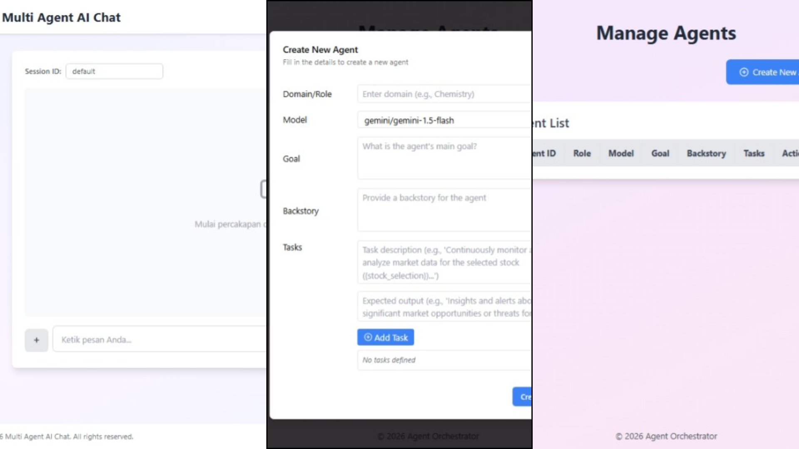

# Multi Agent AI Chat

 <!-- Ganti dengan path gambar screenshot aplikasi Anda -->

Aplikasi frontend berbasis web untuk berinteraksi dengan sistem Multi Agent AI Chat. Aplikasi ini memungkinkan pengguna untuk melakukan percakapan dengan AI, mengunggah dokumen untuk analisis, dan mendapatkan respons yang relevan. Dibangun menggunakan Next.js untuk pengalaman pengguna yang cepat dan responsif.

## Fitur Utama

- **Chat Interaktif**: Lakukan percakapan real-time dengan AI multi-agent.
- **Unggah Dokumen**: Unggah file PDF, DOCX, atau TXT untuk analisis otomatis.
- **Session Management**: Kelola sesi percakapan dengan ID unik.
- **Download Hasil**: Dapatkan file hasil analisis langsung dari chat.
- **UI Responsif**: Desain modern dengan Tailwind CSS untuk pengalaman di desktop dan mobile.
- **Integrasi Backend**: Terhubung dengan backend Python di `http://localhost:5000` untuk pemrosesan AI.

## Teknologi yang Digunakan

- **Frontend**: Next.js 14, React 18
- **Styling**: Tailwind CSS
- **UI Components**: Shadcn/ui (Button, Card, Dialog)
- **Icons**: React Icons
- **Backend Integration**: Fetch API untuk komunikasi dengan server Python
- **Deployment**: Siap untuk Vercel atau platform hosting lainnya

## Persyaratan Sistem

- Node.js 18.x atau lebih baru
- npm, yarn, atau pnpm
- Backend server Python berjalan di `http://localhost:5000` (lihat repositori backend untuk detail)

## Instalasi

1. **Clone repositori ini**:
   ```bash
   git clone https://github.com/hef-max/AI-Multi-Agent-CrewAI.git
   cd AI-Multi-Agent-CrewAI
   ```

2. **Install dependencies**:
   ```bash
   npm install
   # atau
   yarn install
   # atau
   pnpm install
   ```

3. **Konfigurasi environment** (jika diperlukan):
   - Pastikan backend server berjalan di `http://localhost:5000`
   - Sesuaikan URL backend jika berbeda dalam kode

## Menjalankan Aplikasi

1. **Jalankan development server**:
   ```bash
   npm run dev
   # atau
   yarn dev
   # atau
   pnpm dev
   ```

2. **Buka browser**:
   Kunjungi [http://localhost:3000](http://localhost:3000) untuk melihat aplikasi.

3. **Build untuk production**:
   ```bash
   npm run build
   npm start
   ```

## Struktur Proyek

```
├── public/                 # Static assets (gambar, favicon, dll.)
├── src/
│   ├── app/
│   │   ├── globals.css     # Global styles
│   │   ├── layout.js       # Root layout
│   │   ├── page.js         # Halaman utama chat
│   │   └── agents/         # Halaman tambahan (jika ada)
│   ├── components/
│   │   └── ui/             # Komponen UI reusable (Button, Card, dll.)
│   └── lib/
│       └── utils.js        # Utility functions
├── package.json            # Dependencies dan scripts
├── tailwind.config.js      # Konfigurasi Tailwind CSS
└── next.config.mjs         # Konfigurasi Next.js
```

## Penggunaan

1. **Mulai Percakapan**: Ketik pesan di input box dan tekan Enter atau klik tombol kirim.
2. **Unggah Dokumen**: Klik tombol "+" untuk membuka opsi upload, pilih file dari komputer.
3. **Kelola Sesi**: Ubah Session ID untuk memulai percakapan baru.
4. **Download Hasil**: Jika AI memberikan file, klik tombol download di pesan AI.

## Kontribusi

Kontribusi sangat diterima! Silakan buat issue atau pull request untuk perbaikan dan fitur baru.

1. Fork repositori
2. Buat branch fitur (`git checkout -b feature/AmazingFeature`)
3. Commit perubahan (`git commit -m 'Add some AmazingFeature'`)
4. Push ke branch (`git push origin feature/AmazingFeature`)
5. Buat Pull Request

## Lisensi

Proyek ini menggunakan lisensi MIT. Lihat file `LICENSE` untuk detail lebih lanjut.

## Kontak

Untuk pertanyaan atau dukungan, hubungi tim pengembang di [hefrykun10@gmail.com](hefrykun10@gmail.com).

---

Dibangun dengan ❤️ menggunakan Next.js dan Tailwind CSS.
